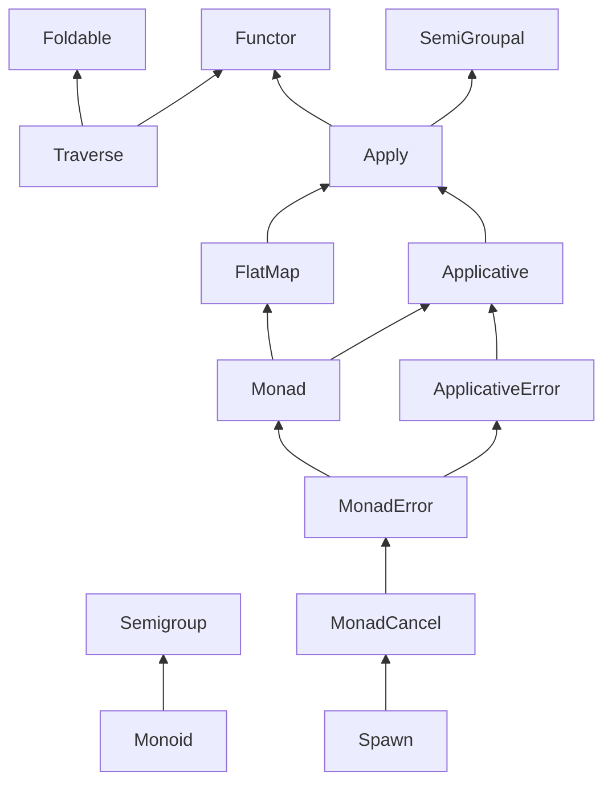

# cats-effect-mine

A repo containing notes and code form the rock the JVM course on the Cats-Effect library

## Cats Typeclass Hierachy continued

```mermaid
graph BT
    
    Monoid --> Semigroup

    Traverse --> Foldable
    Traverse --> Functor
    Apply --> Functor
    Apply --> SemiGroupal
    FlatMap --> Apply
    Applicative --> Apply
    Monad --> FlatMap
    Monad --> Applicative
    ApplicativeError --> Applicative
    MonadError --> Monad
    MonadError --> ApplicativeError
    MonadCancel --> MonadError
    Spawn --> MonadCancel
    
    
```